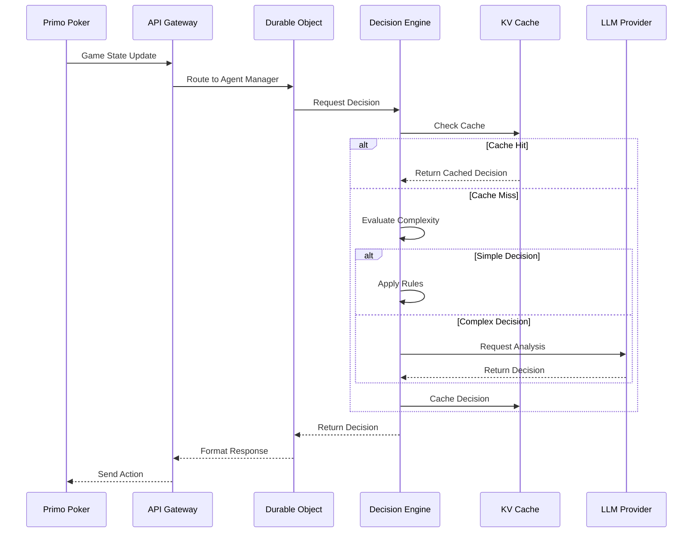

# LibratusLounge Architecture

## Overview

LibratusLounge uses a serverless, event-driven architecture built on Cloudflare Workers. This document describes the key architectural decisions, components, and patterns used throughout the system.

## Core Principles

1. **Serverless First**: Leverage Cloudflare Workers for global distribution and auto-scaling
2. **Stateless Design**: Use Durable Objects for state management, keeping Workers stateless
3. **Cost Efficiency**: Minimize LLM usage through intelligent caching and hybrid decision-making
4. **Low Latency**: Sub-second decision making through edge computing and caching
5. **Fault Tolerance**: Graceful degradation and automatic fallbacks

## System Components

### 1. API Gateway Worker

The main entry point for all requests, handling:
- Request routing
- Authentication
- Rate limiting
- Response formatting

```typescript
// Simplified request flow
export default {
  async fetch(request: Request, env: Env): Promise<Response> {
    const url = new URL(request.url);
    
    switch (url.pathname) {
      case '/api/agents':
        return handleAgentRequest(request, env);
      case '/api/decision':
        return handleDecisionRequest(request, env);
      case '/metrics':
        return handleMetricsRequest(request, env);
      default:
        return new Response('Not Found', { status: 404 });
    }
  }
};
```

### 2. Agent Manager (Durable Object)

Manages agent lifecycle and state:
- Agent creation and configuration
- State persistence between requests
- Decision request coordination
- Performance tracking

```typescript
export class AgentManager extends DurableObject {
  private agents: Map<string, Agent>;
  
  async createAgent(config: AgentConfig): Promise<string> {
    const agent = AgentFactory.create(config);
    const id = generateId();
    this.agents.set(id, agent);
    await this.state.storage.put(`agent:${id}`, agent.serialize());
    return id;
  }
  
  async getDecision(agentId: string, gameState: GameState): Promise<Decision> {
    const agent = this.agents.get(agentId);
    if (!agent) throw new Error('Agent not found');
    
    return await agent.makeDecision(gameState);
  }
}
```

### 3. Decision Engine

The core decision-making system with three tiers:

#### Tier 1: Rule-Based (Fastest)
- Pre-flop hand charts
- Simple pot odds calculations
- Position-based adjustments
- <50ms response time

#### Tier 2: Advanced Heuristics
- Complex hand evaluation
- Opponent modeling
- Multi-street planning
- <200ms response time

#### Tier 3: LLM-Enhanced
- Complex scenarios
- Exploitative adjustments
- Natural language reasoning
- <2000ms response time

### 4. Storage Architecture

#### Workers KV (Decision Cache)
- Key: Normalized game state hash
- Value: Decision with metadata
- TTL: 1 hour for exact matches, 24 hours for similar states

#### D1 Database (Analytics)
- Agent performance history
- Decision logs for analysis
- Aggregated metrics
- Player feedback

#### Durable Objects Storage
- Agent configuration
- Session state
- Temporary decision context

### 5. Integration Layer

#### WebSocket Management
```typescript
class PrimoPokerConnection {
  private ws: WebSocket;
  private heartbeatInterval: number;
  private reconnectAttempts: number = 0;
  
  async connect(): Promise<void> {
    this.ws = new WebSocket(PRIMO_POKER_URL);
    this.setupEventHandlers();
    this.startHeartbeat();
  }
  
  private setupReconnection(): void {
    // Exponential backoff with jitter
    const delay = Math.min(1000 * Math.pow(2, this.reconnectAttempts), 30000);
    setTimeout(() => this.connect(), delay + Math.random() * 1000);
  }
}
```

## Data Flow

### Decision Request Flow



## Caching Strategy

### Multi-Level Cache

1. **Memory Cache** (Worker)
   - Size: 100 entries
   - TTL: 60 seconds
   - Hit rate: ~30%

2. **KV Cache** (Edge)
   - Size: Unlimited
   - TTL: Variable (1-24 hours)
   - Hit rate: ~50%

3. **Similarity Cache**
   - Fuzzy matching for similar game states
   - Confidence-weighted decisions
   - Hit rate: ~20%

### Cache Key Generation

```typescript
function generateCacheKey(gameState: GameState): string {
  const normalized = {
    handStrength: bucketizeHandStrength(gameState.hand, gameState.communityCards),
    potOdds: Math.round(gameState.toCall / gameState.pot * 10) / 10,
    position: gameState.position,
    streetBettingPattern: encodeBettingPattern(gameState.bettingHistory),
    stackDepth: bucketizeStack(gameState.stackSize / gameState.blindLevel.big)
  };
  
  return createHash('sha256')
    .update(JSON.stringify(normalized))
    .digest('hex');
}
```

## Scaling Considerations

### Horizontal Scaling
- Workers automatically scale with load
- Durable Objects shard by game/table
- Cache distributes across edge locations

### Performance Optimization
- Connection pooling for external APIs
- Request batching where possible
- Lazy loading of complex strategies
- Precomputed lookup tables

### Cost Optimization
- Tiered decision making to minimize LLM calls
- Aggressive caching with similarity matching
- Daily budget caps with graceful degradation
- Off-peak batch processing for analytics

## Security

### API Security
- HMAC request signing
- Rate limiting per API key
- Input validation and sanitization
- Encrypted storage for sensitive data

### Game Integrity
- Decision validation before execution
- Bankroll management enforcement
- Anti-collision detection
- Audit logging for all actions

## Monitoring and Observability

### Real-time Metrics
- Decision latency (P50, P95, P99)
- Cache hit rates by tier
- LLM usage and costs
- Error rates and types

### Analytics Pipeline
```typescript
class AnalyticsCollector {
  async trackDecision(metric: DecisionMetric): Promise<void> {
    // Real-time to Analytics Engine
    await this.env.ANALYTICS.writeDataPoint({
      timestamp: Date.now(),
      agentId: metric.agentId,
      latency: metric.decisionTime,
      action: metric.action,
      usedLLM: metric.usedLLM
    });
    
    // Batch to D1 for historical analysis
    await this.batchWriter.add(metric);
  }
}
```

### Alerting Rules
- Decision timeout rate > 1%
- LLM error rate > 5%
- Cache hit rate < 50%
- Cost per decision > $0.01

## Deployment Architecture

### Multi-Environment Setup
- **Development**: Local wrangler dev server
- **Staging**: Isolated Workers with test data
- **Production**: Global Workers deployment

### CI/CD Pipeline
1. GitHub Actions on push
2. Run tests and type checking
3. Deploy to staging
4. Run integration tests
5. Manual approval for production
6. Progressive rollout with monitoring

### Rollback Strategy
- Instant rollback via Cloudflare dashboard
- Automated rollback on error spike
- Feature flags for gradual rollout
- A/B testing infrastructure

## Future Considerations

### Planned Enhancements
1. Multi-table support with shared context
2. Real-time learning and adaptation
3. Advanced opponent modeling with ML
4. Support for additional poker variants

### Scalability Targets
- 10,000 concurrent agents
- <100ms P95 latency globally
- 99.99% availability
- <$0.001 cost per decision

### Technology Evolution
- Explore edge ML models
- Investigate WebGPU for client-side inference
- Consider WASM for performance-critical code
- Evaluate newer LLM architectures