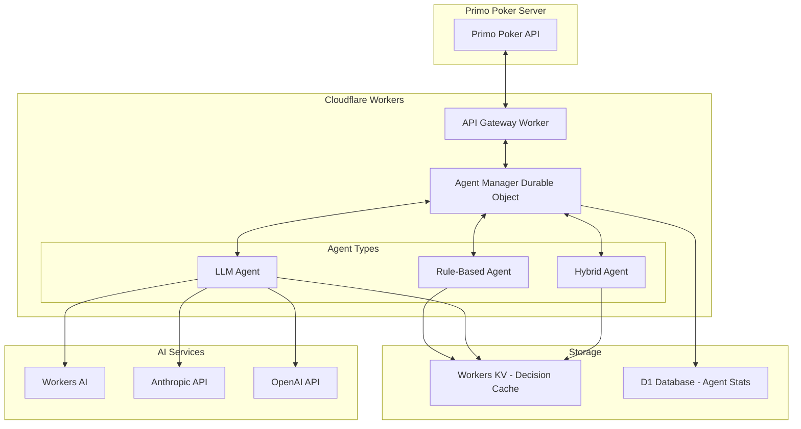

# LibratusLounge Implementation Plan

## Executive Summary

This document outlines the complete implementation plan for LibratusLounge, an AI-powered poker agent system for Primo Poker. The project will be implemented in 6 phases over 7 weeks, starting with basic rule-based agents and progressively adding personality systems and LLM integration.

## Technical Architecture

### System Overview



### Technology Stack

- **Runtime**: Cloudflare Workers (V8 Isolates)
- **Language**: TypeScript 5.x with strict mode
- **State Management**: Durable Objects for agent persistence
- **Caching**: Workers KV for decision caching
- **Database**: D1 for analytics and historical data
- **AI Integration**: Workers AI, Anthropic Claude, OpenAI GPT
- **Testing**: Vitest for unit tests, custom simulation framework
- **Build Tools**: Wrangler CLI, esbuild
- **Monitoring**: Workers Analytics, custom metrics dashboard

## Phase 1: Foundation (Days 1-7)

### Objectives
- Establish project structure and development environment
- Implement core agent interfaces and base classes
- Create Agent Manager Durable Object
- Set up basic game state integration

### Deliverables

#### 1.1 Project Setup
```bash
# Project structure
LibratusLounge/
├── src/
│   ├── index.ts                 # Main Worker entry point
│   ├── agents/
│   │   ├── base-agent.ts        # Abstract base class
│   │   └── types.ts             # Core type definitions
│   ├── durable-objects/
│   │   └── agent-manager.ts     # Agent lifecycle management
│   └── utils/
│       └── logger.ts            # Structured logging
├── tests/
│   └── setup.ts                 # Test configuration
├── wrangler.toml                # Cloudflare configuration
├── tsconfig.json                # TypeScript configuration
└── package.json                 # Dependencies and scripts
```

#### 1.2 Core Interfaces
```typescript
// src/agents/types.ts
export interface Card {
  rank: 'A' | 'K' | 'Q' | 'J' | 'T' | '9' | '8' | '7' | '6' | '5' | '4' | '3' | '2';
  suit: 'h' | 'd' | 'c' | 's';
}

export interface GameState {
  hand: Card[];
  communityCards: Card[];
  pot: number;
  toCall: number;
  position: 'UTG' | 'MP' | 'CO' | 'BTN' | 'SB' | 'BB';
  players: PlayerInfo[];
  bettingHistory: Action[];
  stackSize: number;
  blindLevel: { small: number; big: number };
}

export interface Decision {
  action: 'fold' | 'call' | 'raise' | 'check' | 'all-in';
  amount?: number;
  confidence: number;
  reasoning?: string;
  thinkingTime: number;
}

export interface AgentConfig {
  id: string;
  skillLevel: 'beginner' | 'intermediate' | 'advanced';
  personality?: PersonalityTraits;
  enableLLM: boolean;
  bankroll: number;
}
```

#### 1.3 Implementation Steps

1. **Day 1-2**: Project initialization
   - Set up repository with TypeScript and Cloudflare Workers
   - Configure development environment
   - Create basic project structure
   - Set up testing framework

2. **Day 3-4**: Core interfaces
   - Define all TypeScript interfaces
   - Create base agent abstract class
   - Implement error handling patterns
   - Set up logging infrastructure

3. **Day 5-6**: Durable Object implementation
   - Create Agent Manager Durable Object
   - Implement agent creation and management
   - Add basic request routing
   - Test Durable Object persistence

4. **Day 7**: Integration setup
   - Create API endpoints for agent operations
   - Implement timeout handling
   - Basic integration with mock game state
   - End-to-end testing setup

### Success Criteria
- [ ] Development environment fully configured
- [ ] All core interfaces defined and documented
- [ ] Agent Manager Durable Object operational
- [ ] Basic API endpoints responding correctly
- [ ] Unit tests passing with >80% coverage

## Phase 2: Rule-Based Agents (Days 8-14)

### Objectives
- Implement poker hand evaluation engine
- Create rule-based decision making for all skill levels
- Build position and pot odds calculations
- Implement basic betting strategies

### Deliverables

#### 2.1 Hand Evaluation Engine
```typescript
// src/strategies/hand-evaluation.ts
export class HandEvaluator {
  evaluateHand(cards: Card[]): HandRank;
  calculateHandStrength(hand: Card[], community: Card[]): number;
  calculateOuts(hand: Card[], community: Card[]): number;
  getHandEquity(hand: Card[], community: Card[], opponents: number): number;
}
```

#### 2.2 Strategy Components
- **Pre-flop charts**: Starting hand rankings by position
- **Post-flop evaluation**: Board texture analysis
- **Pot odds calculator**: Mathematical decision framework
- **Position strategy**: Positional advantage exploitation

#### 2.3 Skill Level Implementation

##### Beginner Agent
- Plays 60% of hands
- Uses simplified hand strength (high cards = good)
- Ignores position completely
- Calls frequently, rarely raises
- Never bluffs

##### Intermediate Agent
- Plays 25-30% of hands
- Basic position awareness (tighter in early position)
- Understands pot odds for drawing hands
- Occasional semi-bluffs on draws
- Basic bet sizing (1/2 to 2/3 pot)

##### Advanced Agent
- Plays 18-22% of hands (varies by position)
- Strong positional play
- Calculates implied odds
- Balanced 3-betting range
- Exploits opponent tendencies
- Varies bet sizing based on board texture

### Implementation Steps

1. **Day 8-9**: Hand evaluation
   - Implement 5-card hand ranking
   - Create hand strength calculator
   - Build equity estimation engine
   - Unit test all poker hands

2. **Day 10-11**: Basic strategies
   - Create pre-flop hand charts
   - Implement pot odds calculations
   - Build position evaluation logic
   - Create betting pattern templates

3. **Day 12-13**: Skill level agents
   - Implement beginner agent logic
   - Create intermediate agent
   - Build advanced agent strategies
   - Test decision consistency

4. **Day 14**: Integration testing
   - Run agent vs agent simulations
   - Validate decision making
   - Performance benchmarking
   - Bug fixes and optimization

### Success Criteria
- [ ] Hand evaluator correctly ranks all poker hands
- [ ] Each skill level exhibits expected behavior
- [ ] Agents make decisions within 500ms
- [ ] Win rates align with skill levels in simulations
- [ ] No illegal actions or crashes in 10,000 hands

## Phase 3: Personality System (Days 15-21)

### Objectives
- Design and implement personality trait system
- Create personality engine that modifies decisions
- Build preset personalities with distinct playstyles
- Add chat functionality for table talk

### Deliverables

#### 3.1 Personality Traits System
```typescript
// src/personality/traits.ts
export interface PersonalityTraits {
  aggression: number;        // 0-1: Betting frequency
  tightness: number;         // 0-1: Hand selection
  deception: number;         // 0-1: Bluffing tendency
  tilt_resistance: number;   // 0-1: Emotional stability
  risk_tolerance: number;    // 0-1: Variance preference
  chat_frequency: number;    // 0-1: Table talk amount
  ego: number;              // 0-1: Show-off tendency
  patience: number;         // 0-1: Willingness to wait
}

export class PersonalityEngine {
  modifyDecision(
    baseDecision: Decision,
    traits: PersonalityTraits,
    context: GameContext
  ): Decision;
  
  generateChatMessage(
    traits: PersonalityTraits,
    event: GameEvent
  ): string | null;
  
  adjustTraitsBasedOnResults(
    traits: PersonalityTraits,
    sessionResults: SessionResults
  ): PersonalityTraits;
}
```

#### 3.2 Preset Personalities

1. **Cautious Carl**
   - Very tight (0.85), passive (0.2 aggression)
   - High tilt resistance (0.9)
   - Rarely chats or shows cards

2. **Aggressive Annie**
   - Loose (0.4 tightness), very aggressive (0.85)
   - Moderate tilt resistance (0.6)
   - Frequent table talk

3. **Balanced Bob**
   - GTO-inspired balanced stats
   - High patience and tilt resistance
   - Educational chat messages

4. **Tilting Tim**
   - Normal play until losing
   - Low tilt resistance (0.2)
   - Aggression increases with losses

5. **Chatty Charlie**
   - Average play style
   - Maximum chat frequency
   - Tries to extract information

6. **Silent Sam**
   - Tight-aggressive style
   - Never chats
   - Never shows cards

#### 3.3 Chat System
```typescript
// src/personality/chat-templates.ts
export const CHAT_TEMPLATES = {
  win_big_pot: [
    "Easy game!",
    "Thanks for the chips!",
    "On yer bike!",
    "{}",  // Silent option
  ],
  bad_beat: [
    "Unbelievable...",
    "How do you call that?",
    "Nice catch",
    "{}",  // Silent option
  ],
  bluff_success: [
    "😎",
    "Poker face",
    "{}",  // Silent option
  ]
};
```

### Implementation Steps

1. **Day 15-16**: Personality framework
   - Design trait system
   - Create personality engine
   - Implement decision modification logic
   - Build trait persistence

2. **Day 17-18**: Preset personalities
   - Implement all 6 preset personalities
   - Create personality selection logic
   - Test personality consistency
   - Balance personality strengths

3. **Day 19-20**: Chat system
   - Create chat template system
   - Implement context-aware messages
   - Add personality-based chat selection
   - Test chat appropriateness

4. **Day 21**: Integration and testing
   - Full personality integration
   - Multi-personality table simulations
   - Performance impact assessment
   - User experience testing

### Success Criteria
- [ ] Personalities exhibit consistent behavior patterns
- [ ] Each preset has distinct, recognizable playstyle
- [ ] Chat messages are contextually appropriate
- [ ] No performance degradation from personality system
- [ ] Personalities maintain win rate parity within skill level

## Phase 4: LLM Integration (Days 22-28)

### Objectives
- Integrate LLM providers (Workers AI, Anthropic, OpenAI)
- Create intelligent prompt engineering system
- Build hybrid decision-making framework
- Implement cost management and caching

### Deliverables

#### 4.1 LLM Integration Layer
```typescript
// src/agents/llm/llm-client.ts
export interface LLMProvider {
  name: 'workers-ai' | 'anthropic' | 'openai';
  generateDecision(prompt: string, timeout: number): Promise<LLMResponse>;
  estimateCost(tokens: number): number;
}

export class LLMDecisionMaker {
  private providers: Map<string, LLMProvider>;
  private promptCache: LRUCache<string, Decision>;
  private costManager: CostManager;
  
  async makeDecision(
    gameState: GameState,
    agentConfig: AgentConfig,
    timeout: number = 3000
  ): Promise<Decision>;
}
```

#### 4.2 Prompt Engineering
```typescript
// src/agents/llm/prompts.ts
export class PromptBuilder {
  buildSystemPrompt(agentConfig: AgentConfig): string;
  buildGameStatePrompt(gameState: GameState): string;
  buildDecisionPrompt(options: DecisionOptions): string;
  
  // Structured output format
  buildJSONPrompt(schema: object): string;
}

// Example structured prompt
const DECISION_SCHEMA = {
  action: "fold|call|raise|check|all-in",
  amount: "number (optional)",
  confidence: "number 0-1",
  reasoning: "string (1-2 sentences)"
};
```

#### 4.3 Hybrid Decision System
```typescript
// src/agents/hybrid-agent.ts
export class HybridAgent extends BasePokerAgent {
  private shouldUseLLM(gameState: GameState): boolean {
    // Use LLM for:
    // - Multi-way pots with complex action
    // - River decisions with >50% pot bet
    // - 3-bet+ pots
    // - Unusual betting patterns
    
    // Skip LLM for:
    // - Pre-flop folds
    // - Obvious nuts/air situations
    // - Micro stakes decisions
  }
}
```

#### 4.4 Cost Management
```typescript
// src/utils/cost-manager.ts
export class CostManager {
  private dailyBudget: number;
  private currentSpend: number;
  private tokenPrices: Map<string, number>;
  
  canUseLLM(): boolean;
  recordUsage(provider: string, tokens: number): void;
  getOptimalProvider(urgency: number): string;
  generateCostReport(): CostReport;
}
```

### Implementation Steps

1. **Day 22-23**: LLM infrastructure
   - Set up provider integrations
   - Create unified LLM interface
   - Implement timeout handling
   - Test each provider

2. **Day 24-25**: Prompt engineering
   - Design prompt templates
   - Create structured output parsing
   - Build prompt validation
   - Optimize token usage

3. **Day 26-27**: Hybrid system
   - Implement decision routing logic
   - Create fallback mechanisms
   - Build cache system
   - Test edge cases

4. **Day 28**: Cost optimization
   - Implement cost tracking
   - Create budget enforcement
   - Build provider selection logic
   - Generate cost reports

### Success Criteria
- [ ] All LLM providers integrated and tested
- [ ] Prompts generate valid decisions 99%+ of the time
- [ ] Hybrid system uses LLM for <20% of decisions
- [ ] Average decision cost <$0.001
- [ ] Cache hit rate >70% for similar states
- [ ] Decision latency <2s with LLM, <200ms without

## Phase 5: Performance & Optimization (Days 29-35)

### Objectives
- Implement comprehensive caching system
- Optimize decision-making performance
- Build monitoring and analytics
- Conduct load testing and optimization

### Deliverables

#### 5.1 Advanced Caching System
```typescript
// src/caching/decision-cache.ts
export class DecisionCache {
  private kv: KVNamespace;
  private memory: LRUCache<string, Decision>;
  private similarityEngine: SimilarityEngine;
  
  async getCachedDecision(gameState: GameState): Promise<Decision | null>;
  async cacheDecision(gameState: GameState, decision: Decision): Promise<void>;
  async findSimilarDecisions(gameState: GameState, threshold: number): Promise<Decision[]>;
  
  // Cache key generation with normalization
  private generateKey(gameState: GameState): string;
  private normalizeGameState(gameState: GameState): NormalizedState;
}
```

#### 5.2 Performance Monitoring
```typescript
// src/monitoring/metrics.ts
export class MetricsCollector {
  private analytics: AnalyticsEngine;
  
  trackDecision(metric: DecisionMetric): void;
  trackLLMUsage(usage: LLMUsage): void;
  trackCachePerformance(hit: boolean, similarity: number): void;
  trackAgentPerformance(agentId: string, result: GameResult): void;
  
  async generateDashboard(): Promise<Dashboard>;
}

interface DecisionMetric {
  agentId: string;
  decisionTime: number;
  usedLLM: boolean;
  cacheHit: boolean;
  action: string;
  confidence: number;
}
```

#### 5.3 Load Testing Framework
```typescript
// tests/load/stress-test.ts
export class StressTest {
  async runConcurrentAgents(count: number): Promise<TestResults>;
  async simulateHighFrequencyDecisions(rps: number): Promise<TestResults>;
  async testCacheSaturation(entries: number): Promise<TestResults>;
  async benchmarkLLMProviders(): Promise<BenchmarkResults>;
}
```

### Implementation Steps

1. **Day 29-30**: Caching system
   - Implement multi-tier cache
   - Build similarity engine
   - Create cache warming strategy
   - Test cache effectiveness

2. **Day 31-32**: Performance optimization
   - Profile decision hotspots
   - Optimize hand evaluation
   - Reduce memory allocations
   - Implement lazy loading

3. **Day 33-34**: Monitoring system
   - Set up metrics collection
   - Create real-time dashboard
   - Implement alerting
   - Build analytics queries

4. **Day 35**: Load testing
   - Run stress tests
   - Identify bottlenecks
   - Optimize critical paths
   - Document performance limits

### Success Criteria
- [ ] Cache hit rate >70% in production scenarios
- [ ] P95 decision latency <500ms without LLM
- [ ] Support 100+ concurrent agents per Worker
- [ ] Memory usage <128MB per Worker instance
- [ ] Zero decision timeouts under normal load
- [ ] Monitoring dashboard updates in real-time

## Phase 6: Integration & Production (Days 36-42)

### Objectives
- Complete Primo Poker integration
- Implement production safety features
- Conduct comprehensive testing
- Deploy to production environment

### Deliverables

#### 6.1 Primo Poker Integration
```typescript
// src/integration/primo-poker-client.ts
export class PrimoPokerClient {
  private ws: WebSocket;
  private reconnectStrategy: ReconnectStrategy;
  
  connect(config: ConnectionConfig): Promise<void>;
  authenticate(credentials: Credentials): Promise<void>;
  joinTable(tableId: string, agentId: string): Promise<void>;
  
  handleGameState(handler: GameStateHandler): void;
  sendDecision(decision: Decision): Promise<void>;
  
  disconnect(): Promise<void>;
}
```

#### 6.2 Production Safety Features
```typescript
// src/safety/guardrails.ts
export class SafetyGuardrails {
  // Prevent catastrophic decisions
  validateDecision(decision: Decision, gameState: GameState): ValidationResult;
  
  // Rate limiting
  enforceRateLimit(agentId: string): boolean;
  
  // Bankroll management
  checkBankrollLimit(agentId: string, amount: number): boolean;
  
  // Emergency shutdown
  emergencyStop(reason: string): void;
}
```

#### 6.3 Deployment Configuration
```toml
# wrangler.toml
name = "libratus-lounge"
main = "src/index.ts"
compatibility_date = "2024-01-01"

[env.production]
vars = { ENVIRONMENT = "production" }
kv_namespaces = [
  { binding = "DECISION_CACHE", id = "xxx" }
]
durable_objects.bindings = [
  { name = "AGENT_MANAGER", class_name = "AgentManager" }
]

[env.staging]
vars = { ENVIRONMENT = "staging" }
# Staging configuration

[[analytics_engine_datasets]]
binding = "ANALYTICS"
```

### Implementation Steps

1. **Day 36-37**: Primo Poker integration
   - Implement WebSocket client
   - Create message parsing
   - Handle all game events
   - Test with real server

2. **Day 38-39**: Safety features
   - Implement decision validation
   - Add rate limiting
   - Create emergency stops
   - Test failure scenarios

3. **Day 40-41**: End-to-end testing
   - Full integration tests
   - Multi-agent simulations
   - Performance validation
   - Security audit

4. **Day 42**: Production deployment
   - Deploy to staging
   - Run production tests
   - Deploy to production
   - Monitor initial performance

### Success Criteria
- [ ] Successfully connects to Primo Poker production
- [ ] Handles all game events without errors
- [ ] Passes 24-hour stability test
- [ ] Zero illegal actions in 100,000 decisions
- [ ] Meets all performance SLAs
- [ ] Production monitoring active and alerting

## Risk Mitigation

### Technical Risks

1. **LLM Latency**
   - Mitigation: Aggressive caching, timeout handling, rule-based fallback
   
2. **Cost Overruns**
   - Mitigation: Daily budgets, tiered decision making, cost monitoring

3. **Memory Limits**
   - Mitigation: Efficient data structures, cache eviction, object pooling

4. **Network Failures**
   - Mitigation: Reconnection logic, state persistence, graceful degradation

### Business Risks

1. **Player Detection**
   - Mitigation: Realistic timing, personality variety, human-like mistakes

2. **Regulatory Compliance**
   - Mitigation: Clear bot identification, terms of service compliance

3. **Competitive Advantage**
   - Mitigation: Continuous improvement, A/B testing, player feedback

## Success Metrics

### Performance KPIs
- Decision latency: P50 < 200ms, P95 < 500ms, P99 < 2s
- Availability: 99.9% uptime
- Error rate: <0.1% of decisions
- Cache hit rate: >70%

### Business KPIs
- Player engagement: 20% increase in games played
- Player satisfaction: >4.5/5 rating
- Cost per game: <$0.005
- Agent diversity: 10+ distinct playstyles

### Technical KPIs
- Code coverage: >90%
- Documentation: 100% of public APIs
- Load capacity: 1000+ concurrent agents
- Deploy frequency: Daily releases

## Maintenance Plan

### Daily Tasks
- Monitor error rates and latency
- Review cost reports
- Check agent performance metrics
- Respond to alerts

### Weekly Tasks
- Analyze player feedback
- Update personality parameters
- Review and optimize caching
- Deploy improvements

### Monthly Tasks
- Full system audit
- Performance benchmarking
- Cost optimization review
- Strategy updates based on meta

## Conclusion

This implementation plan provides a structured approach to building a sophisticated AI poker agent system. By following the phased approach, we minimize risk while ensuring each component is thoroughly tested before moving to the next phase. The modular architecture allows for easy updates and improvements post-launch, ensuring the system can evolve with player needs and technological advances.